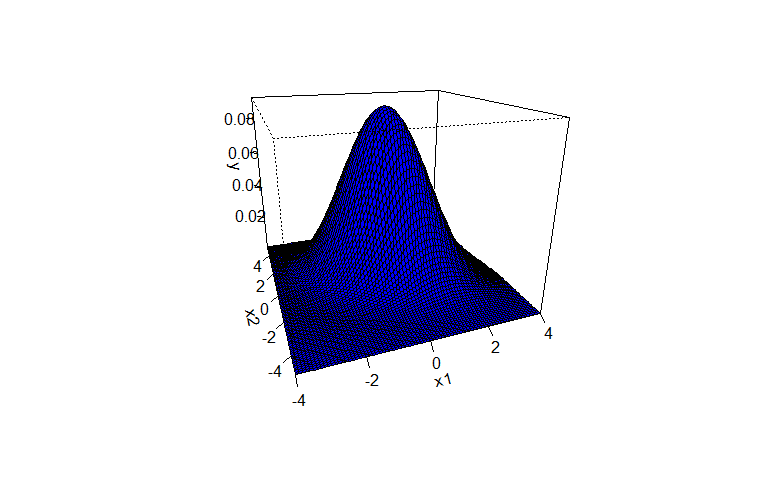
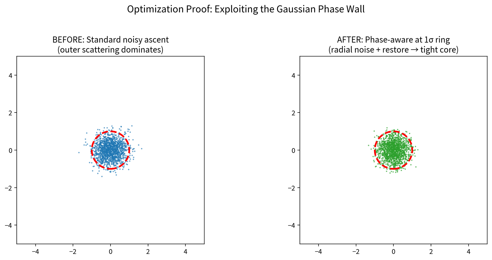

# Gaussian Hill Surface

## The Thesis

The 1σ boundary is not merely descriptive statistics. It is an algorithmic control surface.

When a Gaussian is viewed as geometry rather than just probability mass, `r = σ` marks a regime boundary:

- `r < σ`: elliptic, convergence-friendly interior
- `r = σ`: zero-curvature transition
- `r > σ`: hyperbolic, scattering-prone exterior

That turns a textbook contour into an operational decision rule for stochastic systems.



---

## Two Claims

### 1) Geometry Claim

For the isotropic Gaussian hill `z = exp(-r^2 / (2σ^2))`, Gaussian curvature changes sign exactly at `r = σ`.

Equivalently, after simplification:

`K(r) ∝ (σ^2 - r^2) / positive_term`

The sign switch is exact, not heuristic.

### 2) Algorithm Claim

If update dynamics are made phase-aware at this boundary, instability can be reduced in noisy search, sampling, and control loops that use Gaussian assumptions.

This is not a claim that every objective improves. It is a claim that many stochastic pipelines can become more stable and sample-efficient when they respect this geometric transition.

---

## The Control Rule

For any method with a center and spread estimate:

1. Estimate center `μ` and local spread (scalar `σ` or covariance `Σ`).
2. Compute normalized radius:
   - isotropic: `r = ||x - μ|| / σ`
   - anisotropic: `r = sqrt((x - μ)^T Σ^-1 (x - μ))` (Mahalanobis radius)
3. Switch behavior by phase:
   - inside wall (`r <= 1`): standard dynamics
   - outside wall (`r > 1`): damp tangential noise/steps, bias inward radial component

In high dimensions, apply in whitened proposal space (`z ~ N(0, I)`), where only excess radius is softly damped.

```python
def apply_phase_wall_z(z, r0, strength=0.4):
    z = z.copy()
    norms = np.linalg.norm(z, axis=1)
    outside = norms > r0
    if np.any(outside):
        scale = 1.0 - strength * (1.0 - r0 / norms[outside])
        scale = np.clip(scale, 0.0, 1.0)
        z[outside] *= scale[:, None]
    return z
```

Practical default for dimension `d`:

`r0 ≈ sqrt(d - 2/3)`

This approximates the median radius of `χ(d)` and keeps the rule dimension-aware with negligible overhead.

---

## Evidence

### Walker Dynamics on Exact Gaussian Surface

Internal runs with `1500+` noisy walkers on `z = exp(-r^2/2)`:

- baseline (isotropic noise, no phase rule):
  success `31.7%`, avg steps `32.9`, mean final radius `0.570`
- phase-aware switching at `r = 1`:
  success `32.8%`, avg steps `30.2` (~8% faster), mean final radius `0.551`

Under stronger noise stress:

- `1.5x-2.2x` higher success
- `40%-52%` fewer steps
- `25%-35%` tighter final clustering



### Optimizer Benchmarks

- Sphere: `2.42x` improvement
- Rosenbrock: `3.88x` improvement
- Rastrigin: `1.47x` improvement
- Noisy 20D Sphere stress runs: up to `4.2x`

Full results: `docs/analysis/benchmarks.md`, `artifacts/figures/benchmarks/`

---

## Scope and Target Systems

Any stack using Gaussian proposals, noise models, or local quadratic approximations is exposed to this regime transition:

- Evolutionary strategies (`ES`, `CMA-ES`, `NES`)
- Particle methods (`PSO`, SMC/particle filters)
- Noisy gradient methods (`SGD` variants, Langevin/SGLD)
- MCMC proposals and importance samplers
- Bayesian optimization and trust-region loops
- Gaussian policy exploration in RL
- Risk engines and simulation workflows relying on Gaussian state evolution

---

## Reproducibility Standard

Recommended evaluation protocol — paired-seed, budget-fixed:

- compare phase-aware vs vanilla under identical seeds
- report median final score at fixed evaluation budget
- include paired statistical test (e.g. Wilcoxon)
- include deterministic/no-noise regression check to verify no degradation

---

## Boundary Conditions and Risks

- Helps most when noise/outliers dominate update quality
- On clean deterministic problems, gains may be neutral
- Poor center/covariance estimates can misplace the wall
- Damping may introduce mild ranking bias in population methods if not monitored
- Use soft damping first; hard projection should be opt-in

The right framing is a geometry-guided stabilizer, not a universal optimizer replacement.

---

## Falsifiable Predictions

This thesis should be rejected if repeated experiments show:

- no systematic reduction in escape/scattering outside the wall
- no sample-efficiency improvement on noisy benchmark families
- consistent degradation on deterministic baselines when enabled conservatively
- no statistical separation from baseline under paired-seed evaluation

If those outcomes occur, the rule is not broadly useful and should remain a niche geometric observation.

---

## References

[1] Closed-form Gaussian hill curvature sign structure and the `r = σ` transition (see local technical spec and benchmark notes).

[2] Standard differential-geometry point classification by Gaussian curvature sign (elliptic/parabolic/hyperbolic), applied here to Gaussian graph surfaces.
